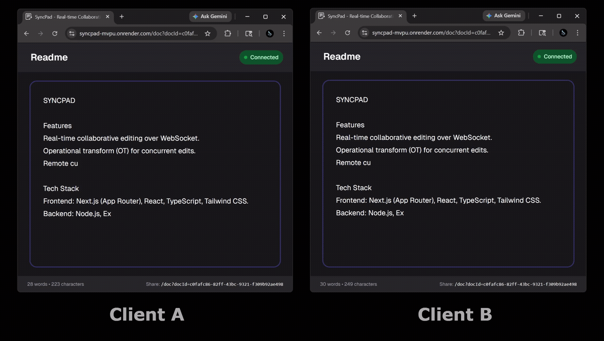

# SyncPad

Real-time collaborative document editing built with a TypeScript backend and a Next.js frontend.

## Showcase

| Collaborative Editing Demo (2 Clients) |
| --- |
|  |

## Features

- Real-time collaborative editing over WebSocket.
- Operational transform (OT) for concurrent edits.
- Document persistence with MongoDB snapshots.
- Optional Redis Pub/Sub fan-out for multi-instance deployments.
- Lightweight document management API (create, list, fetch, rename).
- Remote cursor presence broadcasting.

## Tech Stack

- Frontend: Next.js (App Router), React, TypeScript, Tailwind CSS.
- Backend: Node.js, Express, TypeScript, ws.
- Data: MongoDB (Mongoose).
- Optional scaling component: Redis (ioredis).

## Project Structure

```text
SyncPad/
	backend/
		src/
			collab/       # OT + session + persistence bridge
			config/       # DB connection
			models/       # Mongoose schemas
			redis/        # Redis pub/sub integration
			routes/       # REST API routes
			ws/           # WebSocket server and room manager
	frontend/
		app/            # Next.js routes
		components/     # UI components
		hooks/          # WebSocket + OT client logic
		lib/            # Runtime URL resolution
```

## Architecture Overview

1. A client opens a document and joins a document room over WebSocket.
2. The backend loads (or creates) an in-memory session for that document.
3. Local edits are converted into operations and sent to the backend.
4. The backend transforms incoming operations against document history.
5. The transformed operation is broadcast to connected clients and persisted asynchronously.
6. With Redis enabled, operations are also published so other server instances can apply and forward them in order.

## Prerequisites

- Node.js 20+
- npm 10+
- MongoDB running locally or remotely
- Redis (optional, only if enabling multi-instance pub/sub)

## Environment Variables

Create `backend/.env`:

```env
PORT=8080
NODE_ENV=development
MONGO_URI=mongodb://127.0.0.1:27017/syncpad

# Optional Redis scaling
USE_REDIS=false
REDIS_URL=redis://127.0.0.1:6379
```

Frontend API origin note:

- The frontend currently resolves API origin in `frontend/lib/runtimeUrls.ts`.
- In non-production mode, it defaults to `http://192.168.0.3:8080`.
- Update that fallback to match your backend URL before local setup if needed.

## Local Development

Install dependencies:

```bash
npm install
npm install --prefix backend
npm install --prefix frontend
```

Start backend + frontend together:

```bash
npm run dev
```

Default dev URLs:

- Frontend: `http://localhost:3000`
- Backend HTTP + WS: `http://localhost:8080`

## Available Scripts

At repository root:

- `npm run dev`: Runs backend and frontend concurrently.
- `npm run build`: Installs backend/frontend deps and builds both.
- `npm run start`: Starts backend production server.

In `backend/`:

- `npm run dev`: Run backend with watch mode via `tsx`.
- `npm run build`: Compile TypeScript to `dist/`.
- `npm run start`: Run compiled backend from `dist/server.js`.
- `npm run type-check`: Type-check backend without emit.

In `frontend/`:

- `npm run dev`: Start Next.js dev server.
- `npm run build`: Build frontend.
- `npm run start`: Start Next.js server.
- `npm run lint`: Lint frontend code.

## API Endpoints

Base path: `/documents`

- `POST /documents`
	- Body: `{ "title": string, "userId": string }`
	- Creates a new document.
- `GET /documents?userId=<id>`
	- Lists documents for a user.
- `GET /documents/:id`
	- Fetches one document.
- `PUT /documents/:id`
	- Body: `{ "title": string }`
	- Renames a document.

## WebSocket Protocol

Client -> Server:

- `join`: `{ type: "join", docId, clientId }`
- `operation`: `{ type: "operation", operation }`
- `cursor`: `{ type: "cursor", cursor }`

Server -> Client:

- `init`: `{ type: "init", content, version }`
- `operation`: transformed operation broadcasts
- `cursor`: remote cursor updates
- `cursor-remove`: remove disconnected collaborator cursor

## Production Notes

- Backend production mode serves static files from `frontend/out`.
- Current frontend config uses `output: "export"` in `frontend/next.config.ts`.
- Build from repo root with `npm run build`, then start backend with `npm run start`.
